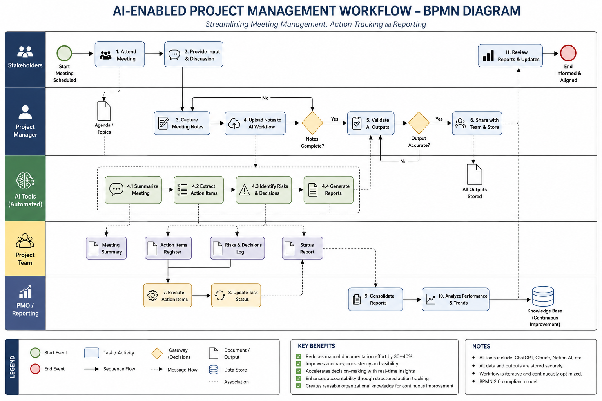

# AI-Powered Project Management Workflow Optimization

## Overview

This project demonstrates an AI-enabled project management workflow designed to improve efficiency in documentation, meeting management, scheduling, and action-item tracking.

It leverages AI tools to reduce manual administrative effort and improve the speed, structure, and consistency of project delivery artifacts.

---

## Problem Statement

Traditional project management workflows often suffer from:

- High manual effort in meeting documentation and reporting
- Delays in converting meeting discussions into actionable tasks
- Fragmented tracking of action items across tools and stakeholders
- Inefficient scheduling and coordination overhead
- Inconsistent documentation quality across projects

These inefficiencies reduce overall delivery speed and operational productivity.

---

## Solution

This workflow introduces an AI-assisted project management system that standardizes and automates key PM activities:

- AI-generated meeting summaries from raw notes
- Automated extraction and structuring of action items
- Standardized project documentation templates
- Streamlined scheduling and coordination workflows
- AI-assisted reporting for status updates and stakeholder communication

The system integrates AI tools into daily project execution to reduce manual workload and improve consistency.

---

## AI Tools Used

- ChatGPT – meeting summarization, action-item extraction, report drafting
- Claude – structured analysis, documentation refinement, long-form synthesis
- Notion AI – knowledge organization, project documentation, content structuring

---

## Workflow Design

### 1. Meeting Capture

- Raw meeting notes are collected during or after meetings
- AI is used to clean and structure unformatted input

### 2. AI Summarization

- Key discussion points are summarized
- Decisions, risks, and dependencies are identified

### 3. Action Item Extraction

- Tasks are automatically identified from meeting content
- Each action item is assigned:
  - Owner
  - Due date
  - Priority

### 4. Documentation Generation

- AI generates standardized outputs:
  - Meeting summaries
  - Status reports
  - Stakeholder updates

### 5. Tracking & Follow-up

- Action items are tracked in a structured format
- Follow-ups are standardized and automated where possible

---

## Example Artifacts

### Meeting Summary (Before AI)

- Unstructured notes
- Mixed decisions and tasks
- Missing ownership clarity

### Meeting Summary (After AI)

- Structured summary with sections:
  - Key discussion points
  - Decisions made
  - Risks & issues
  - Action items

---

## Action Item Tracking Example

| Task | Owner | Due Date | Status | Source |
|------|------|----------|--------|--------|
| Draft project report | PM | 2026-05-15 | In Progress | Meeting #12 |
| Update stakeholder deck | Analyst | 2026-05-16 | Not Started | Meeting #12 |

---

## Key Outcomes

- ~30–40% reduction in manual administrative effort
- Faster turnaround time for documentation and reporting
- Improved clarity and consistency of meeting outputs
- Enhanced visibility of action items and ownership
- Streamlined project coordination and communication

---

## Business Impact

This workflow improves overall project delivery efficiency by:

- Reducing time spent on manual documentation
- Increasing accountability through structured action tracking
- Improving decision traceability across project lifecycle
- Enhancing stakeholder communication quality

---

## Skills Demonstrated

- AI-powered workflow optimization
- Project management process design
- Meeting facilitation and documentation
- Action-item tracking systems
- Operational efficiency improvement
- Digital transformation delivery
- Cross-functional coordination

---

## Target Use Cases

This workflow is applicable to:

- Project Management Offices (PMO)
- Digital transformation programs
- Product and program management teams
- Operations and process improvement teams
- Enterprise delivery environments

---

## Future Enhancements

- Integration with task management tools (Jira, Asana, etc.)
- Automated calendar scheduling workflows
- Real-time AI meeting assistant integration
- Dashboard for action-item tracking and reporting analytics
---
## Methodology Behind Efficiency Estimate

The estimated 30–40% reduction in manual administrative effort is based on comparative workflow simulations and time-tracking analysis across recurring project management activities.

The estimate was derived by comparing:
- Manual meeting documentation workflows
- AI-assisted workflows using ChatGPT, Claude, and Notion AI

Activities evaluated included:
- Meeting summarization
- Action-item extraction
- Status report preparation
- Follow-up coordination

Estimated average effort per meeting:
- Manual workflow: ~45–60 minutes
- AI-assisted workflow: ~25–35 minutes

The results are intended as an illustrative operational model rather than a formal benchmark study.

## How to Use This Repository

1. Review the workflow diagram and repository structure
2. Copy the AI prompt templates from `/01-meeting-management`
3. Paste raw meeting notes into ChatGPT, Claude, or similar AI tools
4. Generate structured outputs such as:
   - Meeting summaries
   - Action-item logs
   - Status reports
5. Store outputs back into project documentation workflows
6. Use the examples in this repository as templates for process optimization initiatives
---
## Author

PMP-certified Project Manager with 10+ years of experience in Banking, Fintech, and ICT, specializing in digital transformation, process improvement, and AI-enabled workflow optimization.

## Disclaimer

All examples in this repository are fictional or anonymized and created for demonstration and educational purposes only.
